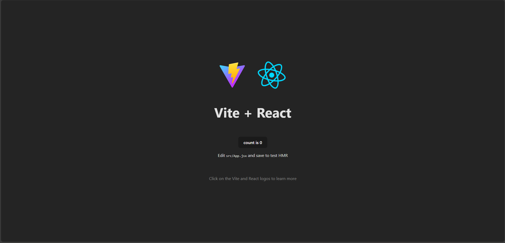

# Commit Policies

**This repository is here to made some research on the setup of policies on commit messages.**

## 📜 Content of the repo

- ReactJS project
  - Used as a test project for researches
- README
  - How to configure / launch the project
  - How to test the researches
  - Researches' notes

## Launch the project

- Create a new branch
  - Manually :
    - On [GitHub project dashboard](https://github.com/archange17/research-on-commit-policies)
  - Bash command :

```bash
git checkout -b <name_branch>
```

> Create a new branch permits to push new modifications if it needed without breaking the repo

- Install dependencies

```bash
npm install
```

- Launch the project

```bash
npm run dev
```

- Go on [localhost:5173](http://localhost:5173)
  - If you obtain this view :

  - **It's all good ✅👍🏻**

## 📌 Commit messages - length check

### `Husky` package - JS/TS projects

#### 🎯 Purpose

The purpose of this part is to configure `Husky` package to block commits when their message exceed a defined number of characters.

The `Husky` package is a tool which permits to easily had some **hooks** on a Git repository (like `pre-commit` or `commit-msg`) for a project JavaScript/TypeScript.

A **hook** is a script executed at a key moment in the life cycle of Git, at a `commit`, a `merge request`, ...

#### How to configure `Husky`

- Install the package
```bash
npm install husky
```
- Create the hook folder `.husky/`
```bash
npx husky install
```
- Configurate the hook/script
```bash
touch .husky/commit-msg
chmod +x .husky/commit-msg
```
  * Content :
```bash
#!/bin/sh
. "$(dirname "$0")/_/husky.sh"

MAX_LENGTH=72   # Set your limit

MESSAGE=$(cat "$1")

if [ ${#MESSAGE} -gt $MAX_LENGTH ]; then
    echo "❌ Error : the message exceed the $MAX_LENGTH allowed characters."
    exit 1
fi

exit 0
```

- To test the config :
```bash
git commit --allow-empty -m "Ce message est beaucoup trop long et dépasse la limite autorisée de caractères pour un message de commit standard."
```

**SPOILER : DON'T WORK ! ❌**
